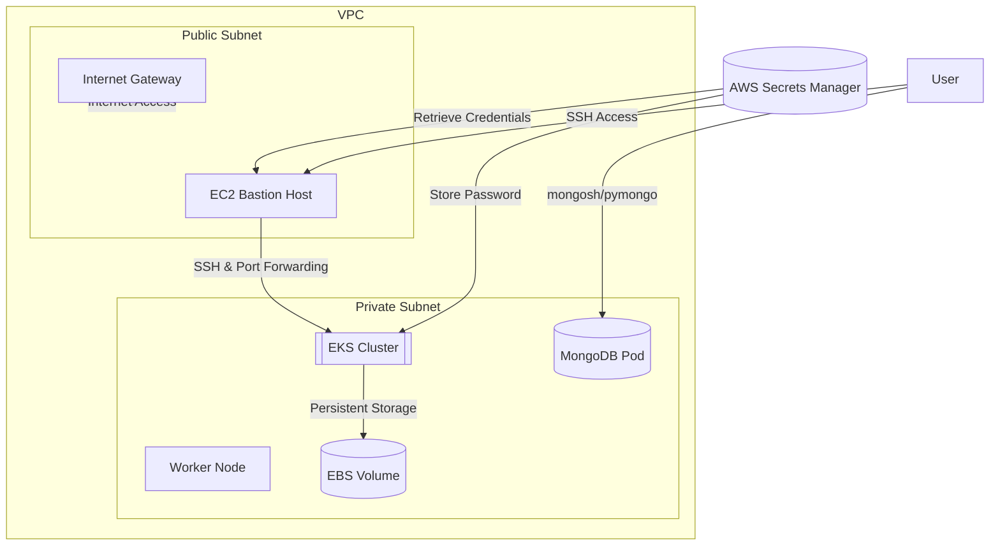

# MongoDB on AWS EKS Cluster - Project Documentation  
**A Terraform & Ansible Automation for Scalable MongoDB Deployment**  

---

## Table of Contents  
1. [Introduction](#introduction)  
2. [Architecture Overview](#architecture-overview)  
3. [Detailed Components](#detailed-components)  
4. [Workflow](#workflow)  
5. [Accessing MongoDB](#accessing-mongodb)  
6. [Repository Structure](#repository-structure)  
7. [Conclusion](#conclusion)  

---

## Introduction  
This project automates the deployment of a highly available MongoDB instance on AWS Elastic Kubernetes Service (EKS) using Terraform for infrastructure provisioning and Ansible for configuration management. The solution includes secure access via a bastion host, dynamic storage provisioning with AWS EBS, and integration with AWS Secrets Manager for credential management.  

**Key Features**:  
- Infrastructure-as-Code (IaC) with Terraform  
- Kubernetes-native MongoDB deployment  
- Secure access via SSH tunneling and RBAC  
- Automated secrets management  

---

## Architecture Overview  
### High-Level Infrastructure Diagram 


#### Components:  
1. **AWS EKS Cluster**: Hosts MongoDB pods in a managed Kubernetes environment.  
2. **EC2 Bastion Host**: Secure jump server for SSH access and port forwarding.  
3. **MongoDB Pod**: Deployed as a stateful set with persistent EBS volumes.  
4. **AWS Secrets Manager**: Stores and retrieves MongoDB root credentials securely.  
5. **VPC & Subnets**: Isolated network with public/private subnets for security.  

### Deployment Workflow Diagram  
 *（Replace with actual diagram）*  

1. **Terraform Provisions Infrastructure**:  
   - EKS Cluster  
   - Bastion Host  
   - Networking (VPC, Subnets, Security Groups)  
2. **Ansible Configures Kubernetes**:  
   - Deploys MongoDB with Helm/Manifests  
   - Sets up storage classes for EBS  
3. **Access Management**:  
   - Port forwarding via bastion  
   - Secrets retrieval from AWS Secrets Manager  

---

## Detailed Components  
### 1. Terraform Infrastructure  
- **EKS Cluster** (`eks.tf`): Configures node groups and IAM roles.  
- **Bastion Host** (`bastion.tf`): Public EC2 instance with strict security group rules.  
- **EBS Storage** (`ebs.tf`): Defines storage classes and persistent volume claims.  
- **Secrets Manager** (`variables.tf`): Stores MongoDB credentials securely.  

### 2. Kubernetes Configuration  
- **MongoDB StatefulSet**: Ensures persistent storage and high availability.  
- **StorageClass** (`ebs-storage-class.yaml`): Dynamically provisions EBS volumes.  
- **Security**:  
  - Kubernetes Secrets for MongoDB passwords  
  - Network policies to restrict pod communication  

### 3. Access Methods  
- **Bastion Host SSH**:  
  ```bash
  ssh -i mongodb-in-eks.pem ec2-user@$(terraform output bastion_public_ip)
